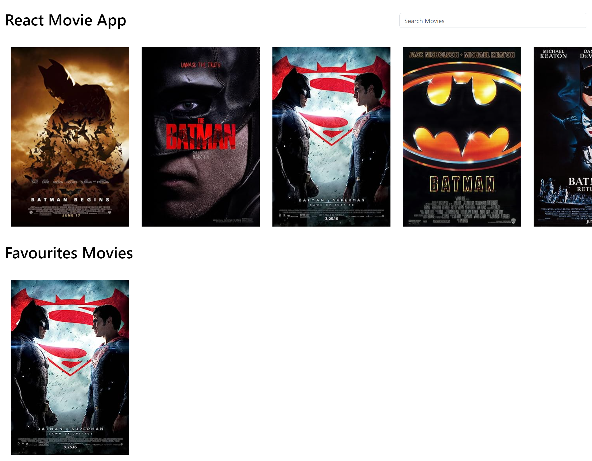

# React Movie App

A dynamic web application built with React that allows users to search for movies using the OMDB API. Users can mark movies as their favorites, and their choices are persisted across sessions using localStorage.

## Screenshot

## Live Demo

Check out the live app: [React Movie App Demo](https://reactmovieappbootstrap.netlify.app/)

## Features

- Movie search functionality via the OMDB API.
- Ability to mark and unmark movies as favorites.
- Favorites persistence using browser's localStorage.
- Responsive design for optimal viewing on all device sizes.

## Built With

- Semantic HTML5 markup
- CSS Custom Properties for styling
- Flexbox and CSS Grid for layout
- JavaScript (ES6+ features)
- React for building the user interface
  - `useState` and `useEffect` hooks for state management and side effects
- Integration with the OMDB API for movie data
- Use of localStorage for persisting user favorites

## How It Works

1. **Search Movies**: Users can search for movies using the search bar. As they type, the app debounces the input to limit API requests and updates the movie list based on the search results from the OMDB API.
2. **Mark Favorites**: Users can click on a movie to mark it as a favorite. The app visually indicates which movies are favorites.
3. **View Favorites**: A separate section displays all the user's favorite movies, which remain saved across browser sessions thanks to localStorage.
4. **Responsive Design**: The app is fully responsive, providing a seamless experience on both desktop and mobile devices.

## Author

- **Sahil**
  - [CodePen: sahil4512](https://codepen.io/sahil4512)
  - [Twitter: @sahil_4512](https://www.twitter.com/sahil_4512)
